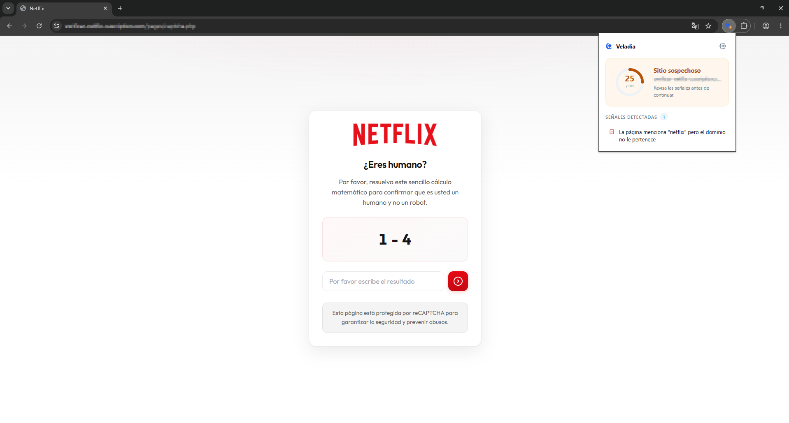

<p align="center">
  
</p>

<h1 align="center">Veladia</h1>

<p align="center">
  <strong>Detector de phishing y sitios sospechosos en tiempo real — 100&nbsp;% local.</strong><br />
  Tu navegación nunca sale de tu equipo.
</p>

<p align="center">
  
  
  
  
  
</p>

---

## ¿Qué es Veladia?

**Veladia** es una extensión de navegador (Chrome / Edge, Manifest V3) que analiza cada
página que visitas y te avisa **antes de que introduzcas tus datos** si el sitio muestra
señales de *phishing* o suplantación.

Lo distintivo es que **todo el análisis ocurre dentro de tu navegador**: Veladia no envía
la URL, el contenido de la página ni ningún dato a servidores externos. Sin telemetría, sin
rastreadores, sin peticiones de red. La privacidad no es una opción, es el diseño.

Veladia es una **capa de apoyo**, no un antivirus: no sustituye las buenas prácticas de
seguridad, pero te da una señal clara y temprana cuando algo no cuadra.

---

## Cómo se ve el estado

El icono de la barra cambia según el riesgo de la pestaña actual:

<p align="center">
  
  &nbsp;&nbsp;&nbsp;
  
  &nbsp;&nbsp;&nbsp;
  
</p>

<p align="center">
  <sub><b>Seguro</b> (círculo verde) · <b>Sospechoso</b> (círculo ámbar) · <b>Peligroso</b> (círculo rojo)</sub>
</p>

Al abrir el popup verás la puntuación de riesgo (0–100), el veredicto y el desglose de
todas las señales detectadas.

---

## Veladia en acción

<p align="center">
  
</p>

<p align="center">
  <sub>Página falsa que se hace pasar por Netflix: Veladia la marca como <b>sospechosa</b> porque
  el contenido menciona la marca pero el dominio no le pertenece.</sub>
</p>

---

## Funciones

- **Puntuación de riesgo 0–100** con veredicto claro: seguro / sospechoso / peligroso.
- **Icono dinámico por pestaña** con indicador circular de estado.
- **Banner de advertencia** configurable en los sitios peligrosos.
- **Popup con el desglose** de cada señal detectada y su categoría.
- **Detección de typosquatting** (distancia de Levenshtein contra marcas conocidas).
- **Reglas de contenido**: formularios que envían credenciales a otro dominio, contraseñas
  sin HTTPS, suplantación de marca, favicon ajeno, iframes a pantalla completa y más.
- **Reputación local**: listas allow/block embebidas + tus propias listas.
- **Soporte de navegación en SPAs** (History API): reanaliza al cambiar de ruta.
- **Ajustes**: sensibilidad (relajada / normal / estricta), banner y tema.
- **Tour de bienvenida** en la primera instalación y **modo oscuro** con grises neutros.

---

## Privacidad

- **Cero datos recopilados.** Veladia no recopila, transmite ni vende información.
- **Análisis 100 % local** con reglas heurísticas ejecutadas en tu dispositivo.
- **Cero peticiones de red externas**, cero analítica, cero rastreadores.
- Tus ajustes y listas se guardan **solo** en tu navegador (`chrome.storage`).

Detalle completo en [PRIVACY.md](./PRIVACY.md).

---

## Instalación (extensión ya compilada)

La carpeta `dist/` incluye la extensión lista para cargar:

1. Abre `chrome://extensions`.
2. Activa el **Modo de desarrollador**.
3. Pulsa **Cargar descomprimida** y selecciona la carpeta `dist/`.

> En la primera instalación se abre automáticamente el tour de bienvenida.

---

## Desarrollo

Requiere Node.js 18+.

```bash
npm install
npm run dev      # desarrollo con hot-reload
npm run build    # build de producción → dist/
npm test         # tests del motor (Vitest)
```

> Recomendación: trabaja el proyecto **fuera de carpetas sincronizadas** (OneDrive, etc.);
> la sincronización puede bloquear archivos durante el build.

---

## Arquitectura

```
src/
├── engine/       # Motor de heurísticas: puro, sin dependencias del navegador y testeable
│   ├── analyzer.ts        # Orquesta reputación + reglas de URL + reglas de contenido
│   ├── url-rules.ts       # Señales basadas en la URL
│   ├── content-rules.ts   # Señales basadas en el DOM de la página
│   ├── reputation.ts      # Listas allow/block (embebidas + del usuario)
│   ├── typosquatting.ts   # Distancia de Levenshtein contra marcas conocidas
│   ├── scoring.ts         # Suma de pesos y clasificación por sensibilidad
│   ├── url-utils.ts       # Parseo de URL y dominio registrable
│   └── types.ts           # Tipos compartidos
├── data/         # Marcas conocidas, TLDs sospechosos y listas de reputación
├── background/   # Service worker: orquestación e icono de estado por pestaña
├── content/      # Recolección del DOM, banner de advertencia y soporte SPA
├── popup/        # UI React: puntuación, señales y estados
├── options/      # UI React: ajustes y listas del usuario
├── welcome/      # Tour de bienvenida
└── shared/       # storage, mensajería y tema
```

**Flujo del análisis**

1. Al cargar o cambiar de pestaña, el *service worker* hace un análisis rápido **por URL** y
   pinta el icono de estado.
2. El *content script* recolecta el contexto del DOM (formularios, iframes, favicon…) y lo
   envía al *service worker*.
3. El motor combina **reputación + reglas de URL + reglas de contenido**, calcula la
   puntuación y clasifica el nivel según la sensibilidad elegida.
4. El popup muestra el resultado y, si procede, se inyecta el banner de advertencia.

---

## Señales de detección

Cada señal aporta un peso; la suma (acotada a 0–100) es la puntuación.

| Categoría   | Señal                                        | Peso |
|-------------|----------------------------------------------|-----:|
| URL         | Dominio parecido a una marca (typosquatting) | 35   |
| URL         | Host es una IP en vez de un dominio          | 30   |
| URL         | La URL contiene `@` (oculta el destino)      | 30   |
| URL         | Punycode (`xn--`, imita caracteres)          | 30   |
| URL         | TLD poco confiable                           | 18   |
| URL         | Demasiados subdominios anidados              | 15   |
| URL         | Palabras típicas de phishing                 | ≤15  |
| URL         | Sin HTTPS                                    | 12   |
| URL         | Muchos guiones en el dominio                 | 10   |
| URL         | Acortador de URL                             | 10   |
| URL         | URL inusualmente larga                       | 8    |
| Contenido   | Formulario de login a otro dominio           | 40   |
| Contenido   | Campo de contraseña sin HTTPS                | 28   |
| Contenido   | Marca mencionada en dominio ajeno            | 25   |
| Contenido   | Favicon de otra marca                        | 18   |
| Contenido   | Iframe a pantalla completa                   | 18   |
| Contenido   | Muchos campos ocultos                        | 10   |
| Contenido   | Casi todos los enlaces son externos          | 8    |
| Reputación  | Dominio reconocido como legítimo             | −40  |
| Reputación  | Dominio en blocklist conocida                | 100  |

**Umbrales por sensibilidad** (sospechoso / peligroso):

| Sensibilidad | Sospechoso | Peligroso |
|--------------|-----------:|----------:|
| Estricta     | 20         | 45        |
| Normal       | 30         | 60        |
| Relajada     | 45         | 75        |

---

## Configuración

Desde la página de **Ajustes** (icono de engranaje en el popup) puedes:

- Elegir la **sensibilidad** del análisis.
- Activar o desactivar el **banner** de advertencia.
- Cambiar el **tema** (automático / claro / oscuro).
- Gestionar tus listas de **dominios de confianza** y **bloqueados**.

---

## Limitaciones

Las listas de reputación embebidas son de muestra. En una versión posterior se generarán
desde feeds reales (PhishTank / OpenPhish / Tranco) en tiempo de build. Veladia no reemplaza
a un antivirus ni a las buenas prácticas de seguridad.

---

## Documentación

- [PRIVACY.md](./PRIVACY.md) — política de privacidad
- [CHANGELOG.md](./CHANGELOG.md) — historial de versiones
- [STORE_LISTING.md](./STORE_LISTING.md) — ficha para la Chrome Web Store

---

## Licencia

MIT — ver [LICENSE](./LICENSE).

---

## Autor

Desarrollado por **Sebastian Guadalupe Tanori Ruiz**.

GitHub: [@tanoriruizs](https://github.com/tanoriruizs)
